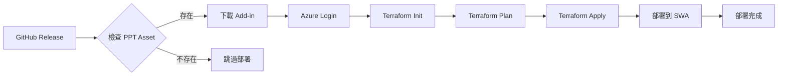

# Azure 自動部署 - PowerPoint Add-in

**日期:** 2025-11-23  
**類型:** CI/CD 自動化

## 概述

建立自動化部署流程，將 PowerPoint Add-in 從 GitHub Release 部署到 Azure Static Web Apps。

## 功能特色

### 🎯 完整自動化

- ✅ **自動觸發** - Release 發布時自動執行
- ✅ **智能檢查** - 驗證 PowerPoint add-in 存在才部署
- ✅ **狀態管理** - Terraform state 安全儲存
- ✅ **OIDC 認證** - 無密碼認證更安全
- ✅ **手動觸發** - 支援手動指定 release 部署

### 🔒 安全性

- **OIDC 認證** - 使用 Federated Credentials
- **環境隔離** - GitHub Environment 保護
- **最小權限** - Service Principal 僅需必要權限
- **狀態加密** - Terraform state 儲存在 Azure Storage

### 📊 可觀察性

- **部署摘要** - GitHub Actions Summary
- **錯誤處理** - 清楚的錯誤訊息
- **跳過通知** - 說明為何跳過部署

## 架構

### 部署流程



### Azure 資源

```
Subscription
├── rg-terraform-state          # Terraform state storage
│   └── st{unique}
│       └── tfstate/
│           └── ppt-addin.tfstate
│
└── rg-{codename}-{suffix}      # Application resources
    └── swa-{codename}-{suffix} # Static Web App
```

## 建立的檔案

### 1. GitHub Workflow

**檔案:** `.github/workflows/deploy-ppt-addin-to-azure.yml`

**功能:**
- Release 發布時自動觸發
- 檢查 PowerPoint add-in 資產
- 執行 Terraform 部署
- 上傳到 Azure Static Web Apps

**Jobs:**

#### Job 1: check-release
```yaml
outputs:
  has_ppt_asset: boolean      # 是否找到 add-in
  download_url: string        # 下載 URL
  release_tag: string         # Release tag
```

**檢查邏輯:**
- 從 release 中尋找 `cloudarchitect-kit-powerpoint-addin.zip`
- 存在 → 繼續部署
- 不存在 → 跳過並顯示說明

#### Job 2: deploy
```yaml
environment: production-ppt    # 使用 GitHub Environment
needs: check-release
if: has_ppt_asset == 'true'
```

**步驟:**
1. 下載 PowerPoint add-in
2. Azure OIDC 登入
3. Terraform init (含 backend 配置)
4. Terraform plan & apply
5. 取得 SWA deployment token
6. 部署到 Azure Static Web Apps
7. 產生部署摘要

#### Job 3: skip-deployment
```yaml
if: has_ppt_asset == 'false'
```

**功能:**
- 顯示跳過原因
- 列出預期資產名稱
- 說明後續動作

### 2. Terraform 配置

**檔案:** `src/powerpoint/terraform/main.tf`

**變更:**
```hcl
terraform {
  backend "azurerm" {
    use_oidc = true
  }
}
```

**特點:**
- 支援遠端 backend
- 使用 OIDC 認證
- Backend 配置通過 CLI 提供

**檔案:** `src/powerpoint/terraform/outputs.tf`

**新增:**
```hcl
output "static_web_app_default_hostname" {
  value = azurerm_static_web_app.main.default_host_name
}

output "static_web_app_url" {
  value = "https://${azurerm_static_web_app.main.default_host_name}"
}
```

### 3. 文件

#### 完整部署指南
**檔案:** `docs/AZURE-DEPLOYMENT.md`

**內容:**
- 架構說明
- 前置需求
- 詳細設定步驟
- Workflow 詳解
- Terraform 配置
- 驗證部署
- 疑難排解
- 最佳實踐
- 進階配置

#### 快速設定指南
**檔案:** `docs/AZURE-SETUP-QUICK.md`

**內容:**
- 快速設定檢查清單
- 複製貼上的命令
- 驗證方法
- 快速參考
- 常見問題

## 使用方式

### 自動部署（推薦）

**觸發條件:**
```yaml
on:
  release:
    types: [published]
```

**流程:**
1. Build workflow 完成並建立 release
2. Deploy workflow 自動觸發
3. 檢查 PowerPoint add-in 存在
4. 部署到 Azure

**無需手動操作！**

### 手動部署

**使用情境:**
- 重新部署舊版本
- 部署失敗後重試
- 測試部署流程

**步驟:**
1. 進入 GitHub Actions
2. 選擇 "Deploy PPT Addin to Azure Static Webapp"
3. 點擊 "Run workflow"
4. 輸入 release tag (例如: `v202511230630`)
5. 點擊 "Run workflow"

## GitHub Environment 設定

### Environment 名稱

```
production-ppt
```

### Secrets

| Secret | 說明 | 取得方式 |
|--------|------|----------|
| `AZURE_CLIENT_ID` | Service Principal Client ID | `az ad sp list` |
| `AZURE_TENANT_ID` | Azure Tenant ID | `az ad sp list` |
| `AZURE_SUBSCRIPTION_ID` | Azure Subscription ID | `az account show` |

### Variables

| Variable | 預設值 | 說明 |
|----------|--------|------|
| `TF_STATE_RESOURCE_GROUP` | rg-terraform-state | State 資源群組 |
| `TF_STATE_STORAGE_ACCOUNT` | st{unique} | State 儲存帳戶 |
| `TF_STATE_CONTAINER` | tfstate | State 容器 |
| `TF_STATE_KEY` | ppt-addin.tfstate | State 檔案名稱 |
| `CODENAME` | pptcloudarch | 專案代號 |
| `ENVIRONMENT` | production | 環境名稱 |
| `AZURE_LOCATION` | East Asia | 資源位置 |
| `SWA_LOCATION` | East Asia | SWA 位置 |
| `SKU_TIER` | Free | SKU 層級 |
| `SKU_SIZE` | Free | SKU 大小 |

## 設定步驟

### 1. Azure 準備

```bash
# 建立 Service Principal
az ad sp create-for-rbac \
  --name "github-cloudarchitect-kits" \
  --role contributor \
  --scopes /subscriptions/{subscription-id}

# 配置 Federated Credential
az ad app federated-credential create \
  --id {client-id} \
  --parameters '{
    "name": "github-cloudarchitect-kits",
    "issuer": "https://token.actions.githubusercontent.com",
    "subject": "repo:{org}/{repo}:environment:production-ppt",
    "audiences": ["api://AzureADTokenExchange"]
  }'

# 建立 State Storage
az group create --name rg-terraform-state --location eastasia
az storage account create \
  --name st{unique} \
  --resource-group rg-terraform-state \
  --location eastasia \
  --sku Standard_LRS
az storage container create \
  --name tfstate \
  --account-name st{unique}
```

### 2. GitHub 設定

```bash
# 建立 Environment
GitHub → Settings → Environments → New environment
Name: production-ppt

# 設定 Secrets (通過 UI 或 CLI)
gh secret set AZURE_CLIENT_ID --env production-ppt
gh secret set AZURE_TENANT_ID --env production-ppt
gh secret set AZURE_SUBSCRIPTION_ID --env production-ppt

# 設定 Variables (通過 UI 或 CLI)
gh variable set TF_STATE_RESOURCE_GROUP --env production-ppt
gh variable set TF_STATE_STORAGE_ACCOUNT --env production-ppt
# ... 其他 variables
```

### 3. 測試部署

```bash
# 手動觸發
gh workflow run deploy-ppt-addin-to-azure.yml \
  -f release_tag=v202511230630

# 監控執行
gh run watch

# 查看結果
gh run view --log
```

## 驗證

### 檢查 Workflow

```bash
# GitHub Actions
https://github.com/{org}/{repo}/actions/workflows/deploy-ppt-addin-to-azure.yml
```

**確認:**
- ✅ check-release job 成功
- ✅ deploy job 成功
- ✅ 部署摘要顯示 URL

### 檢查 Azure

```bash
# 列出資源群組
az group list --query "[?contains(name, 'pptcloudarch')]"

# 取得 Static Web App
az staticwebapp list \
  --query "[?contains(name, 'pptcloudarch')]"

# 取得 URL
az staticwebapp show \
  --name swa-pptcloudarch-{suffix} \
  --resource-group rg-pptcloudarch-{suffix} \
  --query defaultHostname -o tsv
```

### 測試 Add-in

1. 開啟瀏覽器訪問 Static Web App URL
2. 確認檔案可存取
3. 更新 manifest.xml 的 URL
4. 在 PowerPoint 中測試

## 優點

### 1. 完全自動化

**舊流程:**
```bash
1. 手動建置 add-in
2. 手動上傳到 Azure
3. 手動更新 DNS
4. 手動驗證部署
```

**新流程:**
```bash
1. 建立 Release
2. 自動部署 ✨
```

### 2. 安全性提升

**OIDC vs 密碼:**
- ✅ 無需儲存密碼
- ✅ 自動輪換 token
- ✅ 短期有效性
- ✅ 審計追蹤

### 3. 狀態管理

**Remote Backend:**
- ✅ 狀態共享
- ✅ 狀態鎖定
- ✅ 版本控制
- ✅ 備份恢復

### 4. 可追溯性

**每次部署記錄:**
- Release tag
- Commit SHA
- 部署時間
- 資源 URL
- 執行日誌

## 最佳實踐

### 1. Environment 保護

```yaml
# 設定保護規則
production-ppt:
  protection_rules:
    - required_reviewers: 1
    - wait_timer: 5
    - deployment_branch: main
```

### 2. 定期測試

```bash
# 每月測試一次部署流程
# 使用舊 release 重新部署
gh workflow run deploy-ppt-addin-to-azure.yml \
  -f release_tag=v{last-month}
```

### 3. 監控告警

```bash
# 設定 Azure Monitor
az monitor alert-rule create \
  --name "ppt-addin-down" \
  --resource-group rg-pptcloudarch-{suffix} \
  --condition "avg Availability < 99"
```

### 4. 災難恢復

```bash
# 定期備份 Terraform state
az storage blob download \
  --account-name st{unique} \
  --container-name tfstate \
  --name ppt-addin.tfstate \
  --file backup-$(date +%Y%m%d).tfstate
```

## 疑難排解

### 問題 1: 找不到 PowerPoint add-in

**原因:**
- Build workflow 失敗
- Release 未包含 add-in
- 檔名不匹配

**解決:**
```bash
# 檢查 release
gh release view {tag} --json assets

# 應該看到:
cloudarchitect-kit-powerpoint-addin.zip
```

### 問題 2: Azure 登入失敗

**原因:**
- Federated Credential 未正確設定
- Environment 名稱不匹配
- Client ID 錯誤

**解決:**
```bash
# 檢查 Federated Credential
az ad app federated-credential list --id {client-id}

# subject 必須是:
repo:{org}/{repo}:environment:production-ppt
```

### 問題 3: Terraform 初始化失敗

**原因:**
- Storage Account 不存在
- 權限不足
- Backend 配置錯誤

**解決:**
```bash
# 檢查 Storage Account
az storage account show \
  --name {storage-account} \
  --resource-group rg-terraform-state

# 檢查權限
az role assignment list --assignee {client-id}
```

### 問題 4: 部署到 SWA 失敗

**原因:**
- API token 無效
- 內容路徑錯誤
- SWA 配置錯誤

**解決:**
```bash
# 檢查 SWA
az staticwebapp show \
  --name swa-pptcloudarch-{suffix} \
  --resource-group rg-pptcloudarch-{suffix}

# 重新取得 token
cd src/powerpoint/terraform
terraform output static_web_app_api_key
```

## 進階功能

### 多環境部署

建立額外的 environments：

```yaml
environments:
  - production-ppt    # 生產環境
  - staging-ppt       # 測試環境
  - development-ppt   # 開發環境
```

### 自動 Rollback

失敗時自動回滾：

```yaml
- name: Rollback on failure
  if: failure()
  run: |
    terraform workspace select production
    terraform apply -auto-approve previous.tfplan
```

### Slack 通知

部署完成通知：

```yaml
- name: Notify Slack
  uses: slackapi/slack-github-action@v1
  with:
    payload: |
      {
        "text": "✅ PPT Add-in deployed to ${{ steps.swa_name.outputs.swa_url }}"
      }
```

## 相關文件

- [完整部署指南](AZURE-DEPLOYMENT.md)
- [快速設定指南](AZURE-SETUP-QUICK.md)
- [Terraform 文件](../src/powerpoint/terraform/README.md)
- [PowerPoint Add-in 文件](../src/powerpoint/README.md)

## 總結

✅ **完全自動化** - Release → Azure 全自動  
✅ **安全可靠** - OIDC 認證 + 狀態管理  
✅ **易於監控** - 詳細日誌和摘要  
✅ **容易維護** - 清楚的文件和流程  
✅ **可擴展性** - 支援多環境部署  

PowerPoint Add-in 現在可以自動部署到 Azure！🚀
